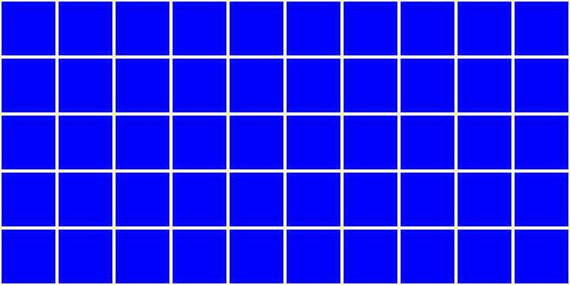

# MatrixMate

This package just makes drawing simple diagrams of matrices easier and faster.
I use these a lot for teaching.

I'll get this up on PyPI soon, but for now see the usage instructions below.

## CLI

Run it using uv:

``` sh
uvx git+https://github.com/wfondrie/matrixmate --help
```

Here's the help:
```
Usage: matrixmate [OPTIONS] N_ROWS N_COLS

  Create a simple matrix graphic.

  The image is sent to stdout.

Options:
  -f, --fill-color TEXT           A Matplotlib-compatible fill color.
  -e, --edge-color TEXT           A Matplotlib-compatible edge color.
  -w, --edge-width FLOAT          Width of the edges.
  -s, --size FLOAT                Size of each cell in inches.
  -d, --dpi FLOAT                 Resolution of the figure. Doesnt affect SVG
                                  outputs.
  -o, --output-format [png|svg|jpg]
                                  The output format.
  --help                          Show this message and exit.
```

Here's an example:

``` sh
uvx git+https://github.com/wfondrie/matrixmate 5 10 -f blue -o svg > mat.svg
```

The output looks like this:



**Protip:** You can use `pbcopy` on copy the image to your clipboard on MacOS instead of saving the file:

``` sh
uvx git+https://github.com/wfondrie/matrixmate 5 10 -f blue -o svg | pbcopy
```

## Python

You can use the Python API:

``` python
import matrixmate as mm
import matplotlib.pyplot as plt

fig, ax = mm.draw_matrix(5, 10, "blue")
plt.savefig("img/mat.svg", format="svg")
```
